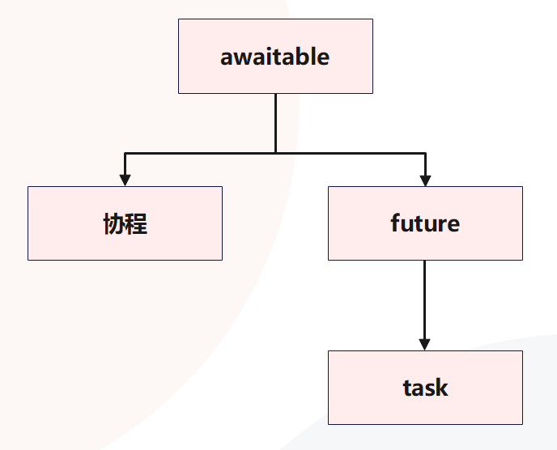
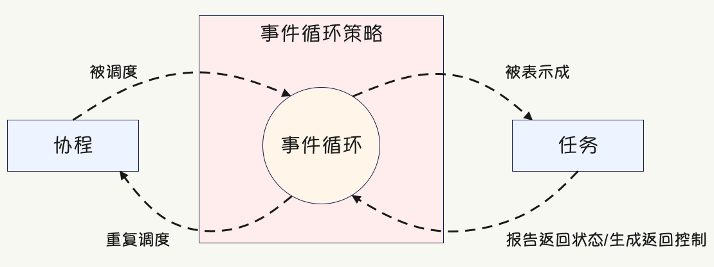

# aiohttp-server-demo

python框架 aiohttp 搭建web服务demo

### conda安装

`mkdir -p ~/miniconda3`
`curl https://repo.anaconda.com/miniconda/Miniconda3-latest-MacOSX-arm64.sh -o ~/miniconda3/miniconda.sh`
`bash ~/miniconda3/miniconda.sh -b -u -p ~/miniconda3`
`rm -rf ~/miniconda3/miniconda.sh`
接着：
`~/miniconda3/bin/conda init bash`
`~/miniconda3/bin/conda init zsh`

你可以通过以下命令来判断是否已安装：
`conda --version`

### 使用虚拟环境

创建虚拟环境：
`conda create -n <ENV_NAME> python=<VERSION>`
查看服务器存在的虚拟环境:
`conda env list`  或 `conda info -e`
激活指定虚拟环境：
`conda activate <ENV_NAME>`
导出环境(该文件处理环境的 pip 包和 conda 包)：
`conda env export > environment.yml`

### aiohttp框架安装

`conda install aiohttp`

### 启动服务

`python3 ./app.py`

## asyncio模块

**事件循环**：管理和调度异步任务的核心组件。
**协程**：使用 async def 定义的函数，可以在事件循环中异步运行。
**任务**：由事件循环调度的协程对象。
**Future**：一个 Python 对象，包含一个希望在未来某个时间点获得、但目前还不存在的值。类似于 JavaScript 中的 Promise。

### 协程

协程，可以看作单线程下多个任务同时进行。
协程的实现方法其实就是迭代器的yield 操作，我们知道在迭代器中，遇到 yield 会中断返回，下次操作时会从这次中断的地方继续执行，在python3.3以后，又加入了yield from 关键字，它后面可以跟迭代器，这样你就可以从一个迭代器中断，进入另一个迭代器去运行，在 asyncio中，await 就相当于 yield from

具体可以看附录第三个问题。

**基础的协程**
以 async def 开始声明一个函数，执行这个函数返回的是一个 cocroutine 对象，函数并不会真的执行（就像执行一个生成器，返回的是一个生成器对象，而不是直接执行代码）
await 会从 cocroutine 获取数据，它调用了这个协程（执行它）
ensure_future/create_task 这两个函数会规划 cocroutine 对象，让它们在下次事件循环（event_loop) 的迭代中去执行（尽管不会去等待它们执行完毕，就像守护进程一样）
创建事件循环，并添加协程对象（Corountine）来执行

### 事件循环 event_loop

事件循环是每个 asyncio 应用的核心。 事件循环会运行异步任务和回调，执行网络 IO 操作，以及运行子进程。
事件循环，就相当于一个大池子，这个池子里可以随时添加 Task，它的作用就是调度运行这些 Tasks。它每次只运行一个 Task，一旦当前 Task 遇到 IO 等操作，事件循环会自动调度运行其他的 Task。

  **获取事件循环**
  以下低层级函数可被用于获取、设置或创建事件循环:
  `asyncio.get_running_loop()`
  返回当前 OS 线程中正在运行的事件循环。
  如果没有正在运行的事件循环则会引发 RuntimeError。
  此函数只能由协程或回调来调用。

  `asyncio.new_event_loop()`
  创建并返回一个新的事件循环对象。

  `asyncio.set_event_loop(loop)`
  将 loop 设为当前 OS 线程的当前事件循环。

  注意: get_event_loop(), set_event_loop() 以及 new_event_loop() 函数的行为可通过设置自定义事件循环策略 来改变。

有这么几个方法可以创建任务，将任务放到事件循环中：
asyncio.ensure_future(coro_or_future, loop)：这个方法不常用（因为它是python较低版本中使用的方法，更高版本可以使用：asyncio.create_task()）， 它可以指定一个事件循环 loop，不指定的话会默认分配一个 loop。如果第一个参数是 coroutine，则会主动给它创建一个task（通过create_task()方法，这时事件已经存在 loop 中了，并返回 task；如果传参是一个future，则会判断 future 的 loop 和你传递的 loop 是不是同一个 loop，不是的话会报错，是的话直接返回；如果传递的是一个可等待对象，则会将此对象包装一下作为 coroutine ，然后再为它创建一个 task。

asyncio.create_task(coro) ：（推荐使用）会直接创建一个 task 放到事件循环中，然后事件循环就会自动调度 Task，在某个task中遇到 IO 阻塞时，就会转去执行其他 task 。

**asyncio 作为为一个库，做了什么，没做什么？**

1. 控制流的暂停与恢复，这是通过 Python 内部的 Generator（生成器）相关的功能实现的。
2. 协程链，即把不同协程链链接在一起的机制。依旧是通过 Python 的内置支持，即 async/await，或者说是生成器的 yield from。
3. Event Loop，这个是 asyncio 实现的。它决定了我们能对什么事件进行异步操作，目前只支持定时器与网络 IO 的异步。
4. 协程链的控制流恢复，即内部的协程暂停了，恢复时却需要从最外层的协程开始恢复。这是 asyncio 实现的内容。
5. 其它的库支持，这里指的是像 asyncio.sleep() 这种协程链的最内层的协程，因此我们一般不希望自己去调用 event loop 注册/注销事件。

**同时运行多个任务**
asyncio.create_task 鉴于任务是立即创建并计划尽快运行，这允许同时运行许多长时间的任务。
最佳实践：在实际工作中，不要直接 await 一个协程，而是将协程包装成任务来让它运行。当你的代码逻辑依赖某个任务的执行结果时，再对该任务执行 await，拿到它的返回值。

**取消任务和设置超时**
取消任务很简单，每个任务对象都有一个名为 cancel 的方法，可以在想要停止任务时调用它。取消一个任务将导致该任务在执行 await 时引发 CancelledError，然后再根据需要处理它。
取消任务注意：CancelledError 只能从 await 语句抛出。这意味着如果在任务在执行普通 Python 代码时被取消，那么该代码将一直运行，直到触发下一个 await 语句（如果存在），才能引发 CancelledError。如果任务在取消的时候已经运行完毕了，那么 await 的时候就不会抛 CancelledError 了。

asyncio 通过名为 asyncio.wait_for 的函数提供此功能，该函数接收协程或任务对象，以及以秒为单位的超时时间。如果任务完成所需的时间超过了设定的超时时间，则会引发 TimeoutException，任务将自动取消。
希望即便超过了规定的超时时间，也不取消该任务，可使用 asyncio.shield 函数包装任务，这个函数将防止传入的协程被取消，会给它一个屏蔽，将取消请求将忽略掉。

**asyncio.gather 和 asyncio.wait_for的区别**

1. wait_for执行顺序是随机的，gather执行顺序是有序的
2. gather和wait_for都能添加一组future，但gather更支持任务分组，而wait则可以在第一个任务完成或指定时间后停止等待操作
3. asyncio.gather(*args) 会针对每个args，使用 ensure_future() 方法。它返回一个总的 *args的结果列表。
4. asyncio.wait_for(aw, timeout) 等待 aw 可等待对象 完成，指定 timeout 秒数后超时

### 任务、协程、future 和 awaitable

**future**
通常，当创建 future 时，它没有任何值，因为它还不存在。在这种状态下，它被认为是不完整的、未解决的或根本没有完成的。然后一旦你得到一个结果，就可以设置 future 的值，这将完成 future。那时，我们可以认为它已经完成，并可从 future 中提取结果。
asyncio.Future， 必须在调用 set_result（设置结果）之后才能调用 result（获取结果），并且 set_result 只能调用一次，但 result 可以调用多次。在设置结果或设置异常的时候，应该通过 set_result() 和 set_exception()，同理获取返回值或异常时，也要用 future.result() 和 future.exception()。
future 也可以用在 await 表达式中，如果对一个 future 执行 await 操作，那么会处于阻塞，直到 future 有一个可供使用的值。这和 await 一个任务是类似的，当任务里面的协程 return 之后会解除阻塞，并拿到返回值。
发出一个返回 future 的请求应该立即完成，但由于请求需要一些时间，所以 future 还处于 PENDING 状态。然后一旦请求完成，结果将被设置，那么 future 会变成 FINISHED 状态，我们就可以访问它了，这个概念类似于 JavaScript 中的Promise。而在 Java 中，这些被称为 completable future。

**future、任务和协程之间的关系**
future 和任务之间有很密切的关系，事实上 Task 继承自 Future。future 可以被认为代表了我们暂时不会拥有的值，而一个任务可以被认为是一个协程和一个 future 的组合。创建一个任务时，我们正在创建一个空的 future，并运行协程。然后当协程运行得到结果或出现异常时，我们将设置 future 的结果或异常。

所以 "await 任务" 什么时候结束，显然是当协程执行完毕并将返回值设置在 future 里面的时候。如果直接 await future，那么需要我们手动调用 future.set_result；如果 await 任务，那么当协程执行完毕时会自动调用 future.set_result（执行出错则自动调用 future.set_exception），因为任务是基于协程包装得到的，它等价于一个协程加上一个 future。

awaitable 对象：一个抽象基类，await 表达式中使用的对象，这个类定义了一个抽象的魔法函数 __await__，任何实现了 __await__ 方法的对象都可以在 await 表达式中使用。

但不管 await 后面跟的是任务还是 future，本质上都是等到 future 里面有值之后，通过 future.result() 拿到里面的值。
任务、future、协程，三者都可以跟在 await 关键字后面，那么它们有没有什么共同之处呢？
它们之间的共同点是 awaitable 抽象基类，协程直接继承自 awaitable，future 也是如，而任务则是对 future 进行了扩展。

### 协程和任务的陷阱

虽然通过将协程包装成任务来并发执行，可以获得一些性能改进，但有些场景下却得不到提升。

  1. 第一个场景：代码是 CPU 密集；
  2. 第二个场景：代码虽然是 IO 密集，但 IO 是阻塞 IO，而不是非阻塞 IO；

**运行 CPU 密集型代码**
当有好几个执行大量计算的函数时，你获取会想到包装成任务并发执行。从概念上讲，这是一个好主意，但请记住 asyncio 使用的是单线程并发型，这意味着仍然受到单线程和全局解释器锁的限制。

当调用 create_task 时，协程就被扔到事件循环当中运行了，但 asyncio 本质上是一个单线程，对于 CPU 密集型是不存在切换的。只有在遇见 IO（并且是非阻塞 IO）的时候，才会切换，但 CPU 密集型处理函数里面没有阻塞。

**运行阻塞 API**
在协程中使用阻塞 IO 密集型操作，会产生和 CPU 密集型操作相同的问题，因为这些 API 会阻塞主线程。所以在协程中运行阻塞 API 调用时，会阻塞事件循环线程本身，这意味其它的任何协程或任务都将暂停。通常执行任何非协程的 IO 操作或执行耗时的 CPU 操作都可视为阻塞。

IO 也分两种：一种是阻塞 IO，比如 requests.get()、time.sleep() 等，这会阻塞整个线程，导致所有任务都得不到执行；另一种是非阻塞 IO，比如协程的 IO 操作，这只会阻塞协程，但线程不阻塞，线程可以执行其它已经准备就绪的任务。

通常，你现在使用的大多数 API 都是阻塞的，且无法与 asyncio 一起使用。如果想和 asyncio 搭配，那么你需要使用支持协程、并利用非阻塞套接字的库，否则就只能进行阻塞调用了，但这样就没办法和 asyncio 一起使用了。
我们可以将 requests 换成 aiohttp 或 httpx，它们可以使用非阻塞套接字，并返回协程，从而获得适当的并发性。如果你只能使用同步库，并且还想和 asyncio 搭配使用的话，那么应该要引入线程池，后续再聊。

### 协程、任务和事件循环之间的关系

asyncio 框架使用事件循环来编排回调函数（callback）和异步任务（asynchronous task），事件循环位于事件循环策略的上下文中，协程、事件循环和策略之间的相互关系如下

协程是一种轻量级的并发模型，这是从广义上来讲的。如果从狭义上来讲，协程就是一个可以暂停、后续还能从暂停处恢复执行的函数，至于在什么地方暂停，则通过专门语法标记进行确定。而协程不能直接运行，必须由事件循环负责驱动，而事件循环在驱动协程执行之前，会先将协程包装成任务。

任务对象可以跟踪协程的状态，并由相应的事件循环进行实例化，事件循环跟踪当前正在运行的任务，并将空闲协程的 CPU 时间片委托给处于挂起（pending）状态的协程。

1. 使用 async 关键字创建协程，协程可在阻塞操作上暂停执行，并允许其他协程运行。一旦协程暂停的操作完成，协程将唤醒并从中断的地方恢复；
2. 通过 await 来驱动协程执行，此时 await 所在的协程将暂停执行，并等待 await 后面所驱动的协程的结果；
3. 使用 asyncio.run 来执行单个协程，可使用该函数来运行作为应用程序主要入口点的协程；
4. 可以使用任务同时运行多个长时间运行的操作，任务是围绕协程的包装器，将通过事件循环运行。创建一个任务时，它会尽快安排在事件循环上运行；
5. 当一个任务的运行时间可能过长，那么可以为任务添加超时，以防止它们一直占用资源。添加超时的方式是通过 asyncio.wait_for，一旦超时则引发 TimeoutError，同时也会将任务取消掉。当然我们也可以在不超时的情况下，手动取消任务，任务取消后会在 await 处引发 CancelledError；
6. 避免在使用 asyncio 时遇到的常见问题，第一个是在协程中运行 CPU 密集型代码，由于 asyncio 是单线程的，CPU 密集型的代码将阻止事件循环运行其他协程。第二个是同步阻塞 IO，因为同步阻塞，阻塞的是整个线程而不是协程。